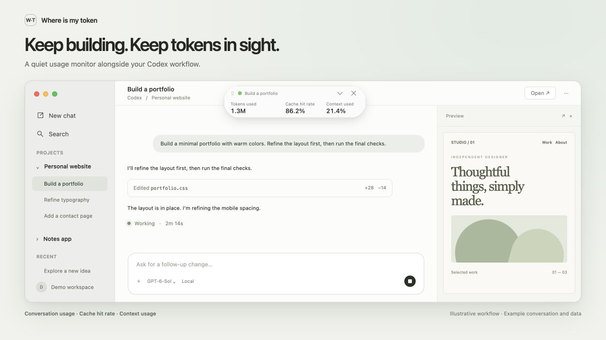
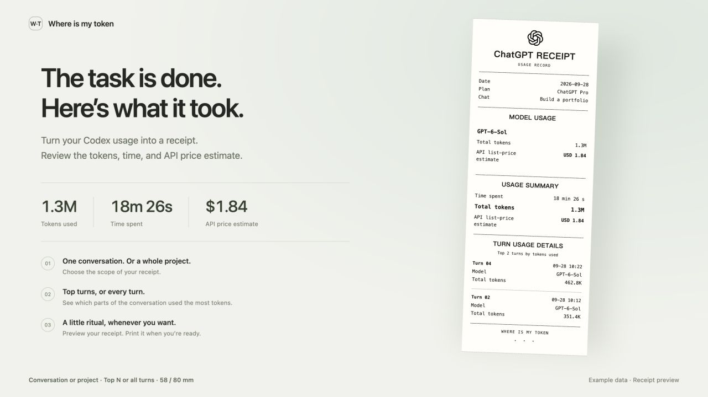
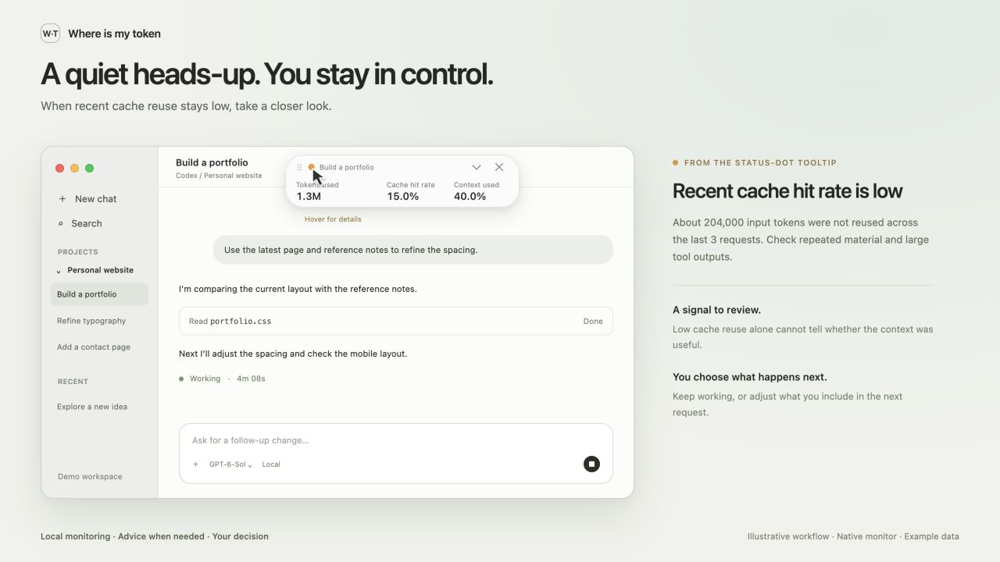
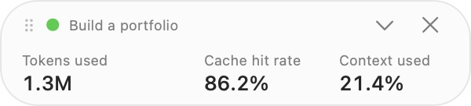
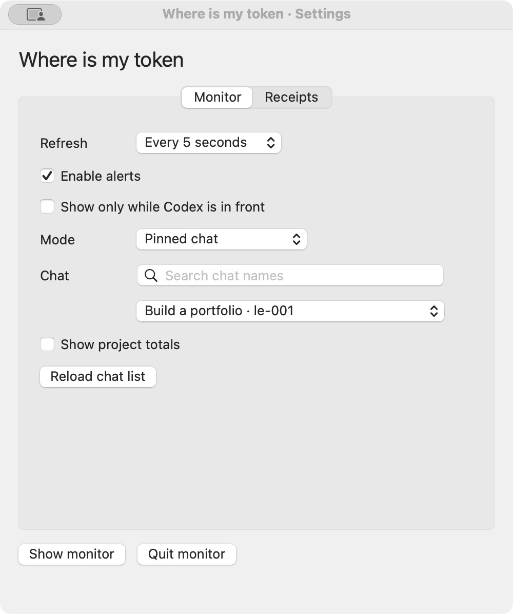

# Where is my token

[简体中文](README.md) · [繁體中文](README.zh-TW.md) · **English** · [日本語](README.ja.md) · [Français](README.fr.md) · [Deutsch](README.de.md) · [한국어](README.ko.md)

[Download the macOS beta](https://github.com/xiu-hu404/where-is-my-token/releases/tag/v0.1.0-beta.4) · [Report a problem or suggest an improvement](https://github.com/xiu-hu404/where-is-my-token/issues)

**Codex token usage monitor and cost tracker for macOS.**

Your task is still running. Your token count keeps climbing. Where is it all going?

Where is my token keeps conversation usage, cache hit rate, and context usage in view. Spot low cache reuse and sustained log growth, find opportunities to reduce token waste, and make more informed decisions while working with Codex.

Illustrated Codex workspace, not a live Codex screenshot. The floating monitor is captured from the app; conversation and usage are illustrative.

## Why use it?

- **See where tokens go.** Track each conversation and its project's totals without digging through logs.
- **Spot opportunities to improve.** Low cache reuse can prompt you to review repeated material, tool output, or how a conversation is structured.
- **Understand the cost.** Estimate usage at API prices and review the highest-usage turns on a printable receipt.
- **Stay in control.** Local monitoring and in-panel advisories leave every workflow decision to you.

Looking for a **Codex token tracker, token usage monitor, cache hit rate monitor, or AI cost calculator**? This tool focuses on Codex on macOS. Low cache reuse is a signal to investigate, not proof of wasted tokens.

**0.1.0-beta.4.** Independent project; not affiliated with or endorsed by OpenAI.

## Features

- Floating monitor for a conversation's tokens, cache hit rate, and approximate context usage.
- Pin a conversation, follow newly submitted user messages, or view its project's totals.
- Local advisories for persistently low cache reuse and sustained log growth.
- API-price estimates and receipt previews with model totals and the top N turns or all turns.
- Conversation or project receipts, 58/80 mm widths, paired Bluetooth devices and macOS printer selection.
- Automatic startup and shutdown with Codex windows; seven built-in interface languages.

No Codex hooks, chat injection, extra model requests, automatic task changes, or automatic deletion. The accounting core also supports user-entered subscription fees and calendar-month allocation through management commands.

## Screenshots

English interface with illustrative data, not private conversations or actual charges. The interface follows the system language, with seven languages built in.

Review your task’s usage and generate a receipt on demand.

The orange status dot highlights low recent cache reuse. Its tooltip text is shown alongside the monitor. This is a signal to review, not proof of wasted tokens.

Monitor and settings

## Install

Requires **Apple Silicon and macOS 15+**. The Python runtime is bundled; users do not install Python, Xcode, or build tools.

Unzip the macOS beta package, open `Where is my token.app`, and choose **Install and start**. Run `Disable.command` to disable startup and stop monitoring while keeping settings and usage data. This beta is not Developer ID signed or notarized.

Closing the last regular Codex window stops the monitor and collector. Reopening a window resumes monitoring. Minimizing does not stop it. An idle launcher remains available for the next window session.

This is a local companion for Codex, not a ZIP to import into its plugin directory. No Codex hooks need to be enabled. Clicking × collapses the monitor into a W·T button; click it to restore the bar.

Usage is processed locally. Necessary statistics are saved in `~/Library/Application Support/Where is my token/`; complete conversations are not copied, and statistics are not uploaded. The interface follows the macOS language and supports English, Simplified Chinese, Traditional Chinese, Japanese, French, German, and Korean. ChatGPT, Codex, and model names stay unchanged. Promotional images are shared in English across all introductions.

## Limitations

Following submitted messages does not track the selected conversation or unsent drafts. Only locally available records are counted. Cache hit rate does not measure answer quality or prove that context is useful. API prices are estimates, and subscription allocation covers collected usage only. Desktop receipts currently focus on API estimates; subscription management uses the command-line interface.

Test-timing advisories are not connected to the floating monitor. Printer-specific protocols and physical output remain unverified. Window lifecycle behavior has been tested with an isolated native window; compatibility with actual Codex versions still needs validation.

## License and feedback

Free, closed-source software for **non-commercial use only**. Free non-commercial copying, modification, repackaging, and redistribution are allowed; resale, paid bundles, and charging for the software’s functionality are prohibited. See the [license](LICENSE).

[Report a problem or suggest an improvement](https://github.com/xiu-hu404/where-is-my-token/issues) · [Privacy](docs/privacy.md) · [Third-party notices](THIRD_PARTY_NOTICES.md)
